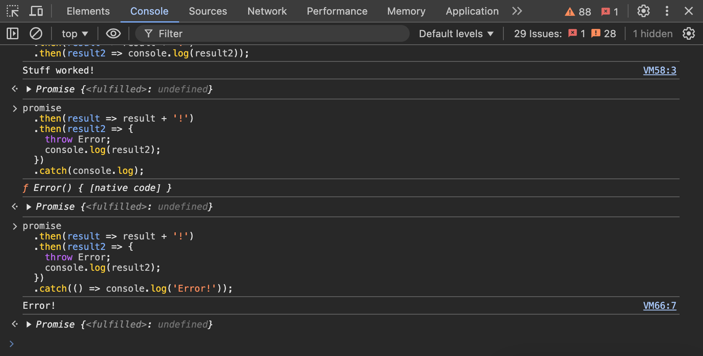

# Promises

`ZTM` Udemy Course - [Complete NodeJS Developer](https://www.udemy.com/course/complete-nodejs-developer-zero-to-mastery).

## Description

Showcase for promises.

> Run code-snippets in web-browser console  
> Example:  
> 

## Useful references

- [Mozilla - Promise](https://developer.mozilla.org/en-US/docs/Web/JavaScript/Reference/Global_Objects/Promise)
- [W3School - JavaScript Promises](https://www.w3schools.com/js/js_promise.asp)
- [API - {JSON} Placeholder](https://jsonplaceholder.typicode.com/)